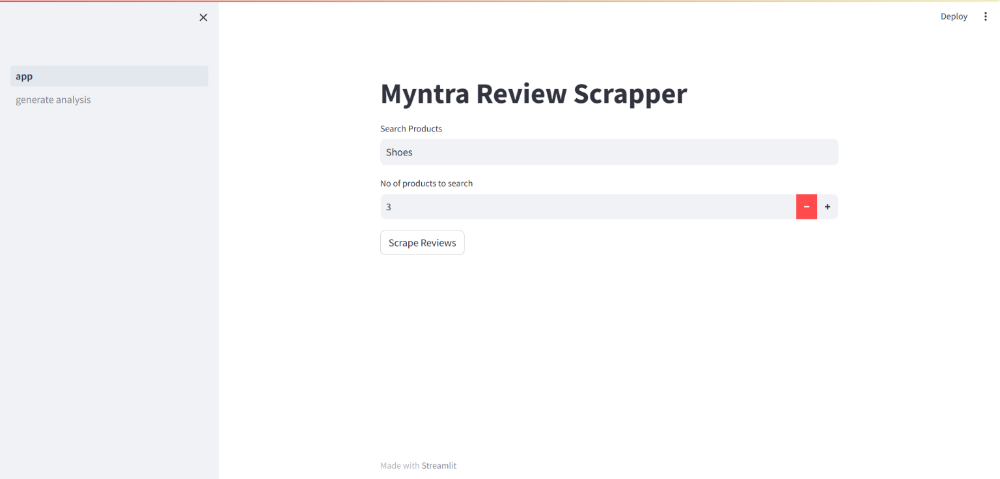
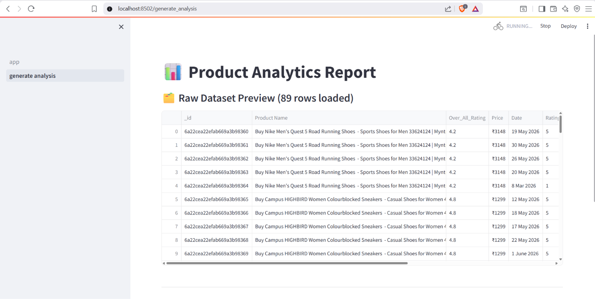
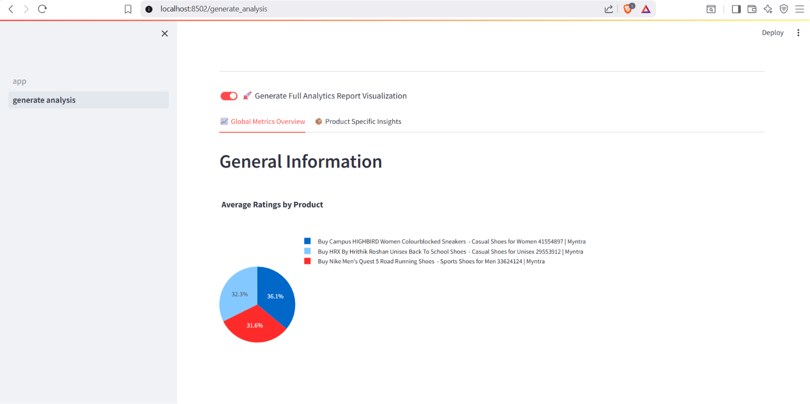

# Myntra Review Scraper & Analysis

A Streamlit-based application that automates Myntra product review collection,
stores data in MongoDB, and generates interactive analytical insights through
custom dashboards.

## Overview

The project automates the process of collecting customer reviews from Myntra and
analyzing them through an interactive dashboard. It combines web scraping,
data storage, and analytics to help users explore customer feedback, ratings,
and product-related insights in a structured manner.

---

## Application Preview

### Product Search Interface


### Scraped Review Results


### Product Analytics Dashboard



---

## Features

- Search products available on Myntra
- Scrape customer reviews automatically
- Extract product information including:
  - Product Name
  - Product Rating
  - Product Price
  - Customer Reviews
- Store review data in MongoDB
- Generate analytical reports and insights
- Interactive Streamlit-based interface

---

## Project Workflow

1. User enters a product name.
2. Selenium searches the product on Myntra.
3. Product URLs are collected.
4. Reviews and product details are scraped.
5. Data is stored in MongoDB.
6. Streamlit dashboard generates analytical insights.
7. Users explore review data and trends.

---

## Tech Stack

### Programming Language
- Python

### Web Scraping
- Selenium
- BeautifulSoup

### Data Processing
- Pandas
- NumPy

### Database
- MongoDB

### Frontend
- Streamlit

### Analytics & Visualization
- Pandas
- Custom Dashboard Generator

---

## Project Structure

```text
myntra_review_project/
│
├── screenshots/
│   ├── homepage.png
│   ├── dashboard.png
│   └── reviews.png
│
├── app.py
├── data.csv
├── requirements.txt
├── myntra.ipynb
│
├── pages/
│   └── generate_analysis.py
│
├── src/
│   ├── scrapper/
│   ├── data_report/
│   ├── cloud_io/
│   ├── constants/
│   └── utils/
│
├── static/
├── templates/
└── README.md
```

---

## How to Run

```bash
pip install -r requirements.txt
streamlit run app.py
```

---

## Learning Outcomes

- Web Scraping using Selenium and BeautifulSoup
- Data Collection and Processing Pipelines
- MongoDB Integration
- Streamlit Application Development
- Customer Review Analytics
- Dashboard Creation and Data Visualization
